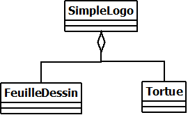
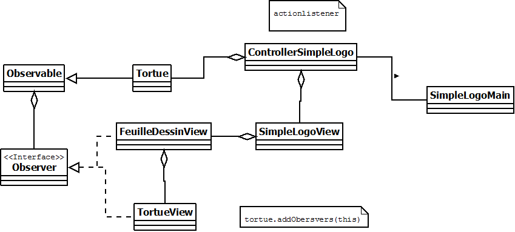
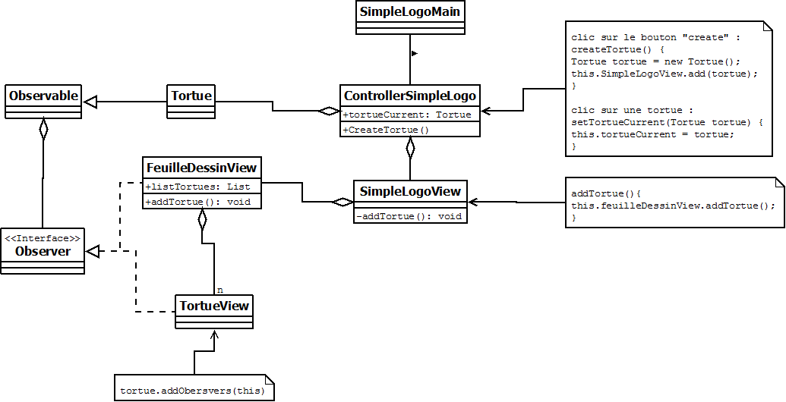
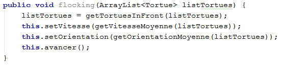
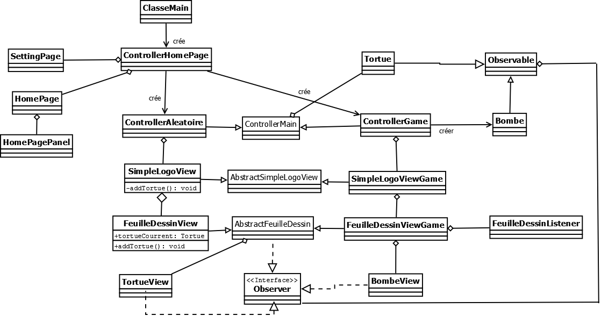

**GARIN Lucas**

**PRIEUR DE LA COMBLE Florian**

**CALVI Alexis**

# Rapport TP4

## Question 1

"Diagramme de classe initial"

La classe SimpleLogo contient le main, qui va lancer une instance de celle-ci.
Cette classe instancie FeuilleDessin et Tortue.
Tout est géré dans la classe SimpleLogo.

Le code contient de l'anglais et du français, que ce soit au niveau des méthodes ou des variables.
Il faudrait uniformiser cela pour améliorer la visibilité.
La gestion des actions liées aux boutons se fait avec un elseif. Il faudrait créer une interface et des classes pour les 
différentes actions.
Le code ne respecte pas le modèle MVC. Dans la même méthode, la partie graphique et métier est traitée. 
Il faut séparer cela.
Enfin, le main est dans la méthode SimpleLogo. Il faudrait plutot créer un launcher, contenant le main et qui lance notre
application.

## Question 2

"Diagramme du code suivant le modèle MVC"

## Question 3
*Rien à rédiger*

## Question 4

Ce diagramme était celui du début de notre projet, avant la mise en place du flocking et de l'extension. 
Lors de cette version, on pouvait ajouter des tortues, en sélectionner une qui devenait la tortue courante 
et la contrôler avec les flèches du clavier. On a hésiter à combiner cette option de contrôle de tortue avec 
le flocking mais on est finalement parti sur le principe de bombes. 

## Question 5

#### Flocking:
Au lancement de l'application, chacune des tortues éparpillées sur le terrain adopte une direction aléatoire et 
une vitesse. Ensuite, on lance un flocking en boucle. Le controleur parcours en permanence la liste des tortues 
en lançant leur méthode flocking().

On récupère la liste des tortues visibles par la tortue (en fonction de son champ de vision et la portée de sa vue). 
Ensuite, si elle voie des tortues, on va recalculer sa direction à partir de la moyenne de la direction de toutes 
les tortues qu'elle voie. On a utilisé le théoreme d'Al Kashi pour calculer la nouvelle direction. 

#### Ajout de fonctionnalitées:  
En plus d'un simple flocking, nous avons ajouté le flocking par couleur (l'utilisateur a la main sur le nombre 
de tortues et leur vision).
Notre application présente deux mode, le premier "Mode aléatoire" est plutôt destiné à de la décoration puisqu'il 
s'agit uniquement d'une simulation de flocking entre tortues de plusieurs couleur. Le deuxième mode est un mode 
arcade qui permet à l'utilisateur d'intéragir.

## Le mode Bombe

Dans le mode Bombe, l'utilisateur a la possibilité de poser une bombe en cliquant à un endroit avec sa souris. 
Cette "bombe" va faire fuir les tortues qui vont avoir tendance à s'éparpiller en partant à la direction 
inverse de la bombe. Elles sont également propulsées à l'exterieur du rayon d'impact de la bombe (il est changeable 
lorsque vous lancer ce mode). Nous avons décidé d'implémenter cette fonctionnalitée afin de pouvoir observer au bout 
de combien de temps les tortues se réorganisent grâce au flocking.

## Diagramme de classe:

Nous avons utilisé un pattern abstract factory qui nous permet de créer les deux modes de jeux. 
Ici c'est la classe ControllerMain qui joue le rôle d'abstract Factory et les deux classes ControllerAleatoire 
et ControllerGame (mode bombe) jouent le rôle de Factory. En plus de créer les différents objets, ces classes jouent 
le rôle de controlleurs. 

Notre conception de l'application permet d'ajouter facilement des nouvelles fonctionnalitées que ce soit dans le mode
aléatoire ou le mode bombe ou les deux en même temps gràce à la classe abstraite pour chacune des classes de ces modes
Le patron de conception MVC rend le code facile à comprendre et permet d'organiser facilement le travail sur le code.

